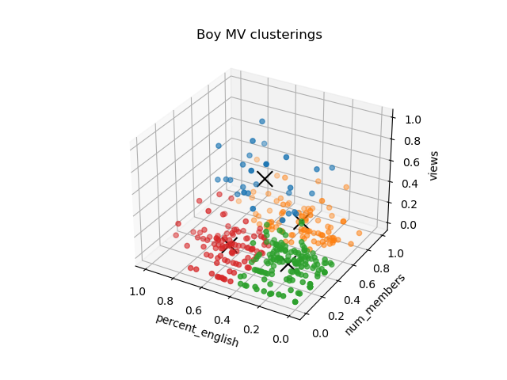

# K-means Visualizations

## Notes

- **Why did you pick this representation?**
  - We thought that using colors would be a clean and easy way communicate the different clusters of music videos. We also decided that plotting all the music videos as points in 3 dimensional shape, colored by cluster, would help the reader visualize the results that we are trying to portray (ie that there weren't any natural clusters)
- **What alternative ways might you communicate the result?**
  - We could have used a table that listed each music video and the cluster it belongs to, along with other numerical measures like it's distance from it's center. We also could have instead plotted average similarity scores in a 2d graph according to the cluster instead of graphing each point by itself.
- **Were there any challenges visualizing the results, if so, what where they?**
  - Yes, there was some difficulty in getting the 3d plot to work with matplot, but eventually we figured it out by following examples in previous homework assignments.
- **Will your visualization require text to provide context or is it standalone (either is fine, but it’s recognized which type your visualization is)?**
  - We think our visualization would benefit from some textual context. For example, we would note that we normalized each axis, which would alleviate confusions over why they all range from 0 to 1. We also think some written interpretation could help, as the graphs might be a bit confusing without it.
